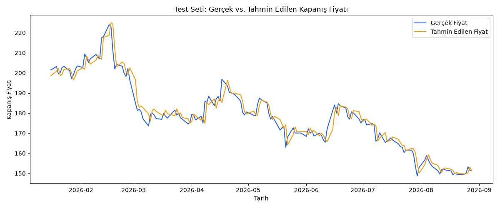

# Stock Price Prediction with PyTorch (LSTM & GRU)

## Proje Amacı

Bu proje, PyTorch kullanarak geçmiş hisse senedi verilerinden gelecekteki fiyat hareketlerini tahmin etmeyi amaçlayan bir zaman serisi tahmin uygulamasıdır. LSTM ve GRU mimarilerinin performansını karşılaştırarak hisse senedi fiyat tahmininde hangi modelin daha başarılı olduğunu ortaya koymayı hedefler.

## Description

A time-series stock price prediction pipeline built with PyTorch. This project fetches historical stock data, performs exploratory data analysis, and trains deep learning sequence models to forecast future prices. The main goal is a **comparative study of LSTM vs. GRU architectures**, evaluating which recurrent model performs better on stock price forecasting.

## 🚀 Project Roadmap (4 Weeks)

### 📊 Week 1: Data Acquisition & Exploratory Data Analysis (EDA)
- [x] Set up the GitHub repository structure and virtual environment.
- [x] Fetch historical stock data using Yahoo Finance (yfinance) or pandas-datareader.
- [x] Perform Exploratory Data Analysis (EDA) using Pandas and Matplotlib/Seaborn.
- [x] Deliverable: Jupyter Notebook with data visualizations and clean, saved CSV datasets.

### ⚙️ Week 2: Data Preprocessing & Baseline LSTM Model
- [x] Prepare the dataset for time-series (scaling, sequence creation, train-test split).
- [x] Create PyTorch Dataset and DataLoader classes.
- [x] Build and train a baseline LSTM model in PyTorch.
- [x] Deliverable: Working PyTorch training pipeline with training loss visualization.

### 🧠 Week 3: GRU Model Implementation & Hyperparameter Tuning
- [x] Implement the GRU model architecture in PyTorch.
- [x] Train the GRU model on the same prepared dataset.
- [x] Experiment with hyperparameters (learning rate, hidden dimensions, epochs).
- [ ] Deliverable: Trained LSTM and GRU model weights saved locally.

### 📈 Week 4: Model Evaluation, Comparison & Final Polish
- [ ] Evaluate both models on test data using metrics like RMSE, MSE, and MAE.
- [ ] Plot predictions vs. actual stock prices for both models.
- [x] Document final results, limitations, and key learnings in the README.md.
- [ ] Deliverable: Fully completed GitHub repository, clean notebook, and a comparison table.

## Klasör Yapısı

```
├── data/
│   ├── raw/                       # fetch_data.py ile indirilen ham OHLCV CSV'leri (git'e dahil değil)
│   └── processed/                 # preprocess.py çıktısı: train/val/test.csv + scaler.pkl (git'e dahil değil)
├── models/
│   └── best_model.pt              # En iyi validation loss'ta kaydedilen model ağırlıkları (git'e dahil değil)
├── notebooks/
│   ├── 01_data_exploration.ipynb  # Veri keşfi, temizlik, teknik göstergeler (SMA/RSI/MACD)
│   └── 02_results.ipynb           # Final metrikler ve tahmin grafiği özeti
├── results/
│   ├── loss_curve.png             # Train/validation loss eğrisi
│   └── predictions_vs_actual.png  # Test setinde gerçek vs. tahmin edilen fiyat
├── scripts/
│   ├── fetch_data.py              # yfinance ile OHLCV verisi indirme
│   ├── preprocess.py              # Teknik gösterge ekleme, train/val/test bölme, ölçekleme
│   ├── test_dataset.py            # StockDataset + DataLoader shape testi
│   ├── hyperparameter_search.py   # lr / hidden_size / lookback için manuel grid search
│   ├── compare_models.py          # LSTM vs GRU: final val loss ve eğitim süresi karşılaştırması
│   ├── evaluate.py                # Test seti değerlendirmesi (RMSE/MAE/MAPE) ve tahmin grafiği
│   └── symbols/bist30.txt         # BIST-30 sembol listesi
├── src/
│   ├── dataset.py                 # StockDataset (kayan pencereli PyTorch Dataset)
│   ├── models.py                  # LSTMModel & GRUModel tanımları
│   └── train.py                   # train_one_epoch / validate / train_model ve tam eğitim döngüsü
├── app.py                         # Masaüstü GUI: BIST-30 sembol listesi + "Analiz Et" butonu
├── requirements.txt
└── README.md
```

## Kurulum

```bash
python -m venv venv

# Windows
venv\Scripts\activate
# macOS/Linux
source venv/bin/activate

pip install -r requirements.txt
```

## Kullanım

### 1. Veri indirme

```bash
python scripts/fetch_data.py THYAO.IS
# veya BIST-30 listesindeki tüm semboller için:
python scripts/fetch_data.py --list-file scripts/symbols/bist30.txt
```

### 2. Ön işleme (teknik göstergeler + kronolojik train/val/test bölme + ölçekleme)

```bash
python scripts/preprocess.py --symbol THYAO.IS
```

`data/processed/` altına `train.csv`, `val.csv`, `test.csv` ve (sadece train ile fit edilmiş) `scaler.pkl` kaydedilir.

### 3. Eğitim

```bash
python src/train.py
```

`LSTMModel`'i 25 epoch eğitir; en iyi validation loss'ta model `models/best_model.pt` olarak, loss eğrisi `results/loss_curve.png` olarak kaydedilir.

### 4. Değerlendirme

```bash
python scripts/evaluate.py
```

`models/best_model.pt`'yi test setinde çalıştırır, tahminleri gerçek fiyat birimine çevirip RMSE/MAE/MAPE'yi konsola yazdırır ve `results/predictions_vs_actual.png` grafiğini üretir.

### Diğer scriptler (opsiyonel)

```bash
# LSTM ile GRU'yu aynı hiperparametrelerle karşılaştır (final val loss + eğitim süresi)
python scripts/compare_models.py

# lr / hidden_size / lookback için manuel grid search, en iyi 3 kombinasyonu yazdırır
python scripts/hyperparameter_search.py
```

## Masaüstü Uygulaması (GUI)

Komut satırı yerine tek pencereden çalışmak için basit bir Tkinter arayüzü de var:

```bash
python app.py
```

Açılış ekranında **HisseAnaliz** başlığı ile **Projenin Amacı** / **Nasıl Kullanılır** bilgi butonları bulunur (tıklandığında açıklama metni ekranda aşağı doğru açılır). Sol menüdeki lacivert BIST-30 butonlarından birine tıklayınca o hissenin güne başlangıç fiyatı gösterilir; altındaki **Analiz Et** butonuna basınca uygulama seçilen hisse için `fetch_data.py` → `preprocess.py` → `train_model()` (25 epoch) → `run_evaluation()` adımlarını arka planda (arayüzü kilitlemeden) sırayla çalıştırır. İşlem sürerken adım adım ilerleme günlüğü, tamamlanınca RMSE/MAE/MAPE metrikleri ile loss/tahmin grafikleri pencerede gösterilir. Her analiz bir öncekinin `data/processed/`, `models/best_model.pt` ve `results/` çıktılarının üzerine yazar — yani uygulama her an tek bir aktif analiz durumunu gösterir.

## Sonuçlar

`models/best_model.pt` (en iyi validation loss'ta kaydedilen LSTM modeli), THYAO.IS test seti üzerinde:

| Metrik | Değer |
| --- | --- |
| RMSE | 9.27 TL |
| MAE | 7.03 TL |
| MAPE | %2.29 |



Ayrıntılı metrik hesaplaması ve grafik için bkz. `scripts/evaluate.py` ve `notebooks/02_results.ipynb`.

## Sınırlamalar

- Model tek bir sembol (THYAO.IS) üzerinde eğitildi ve değerlendirildi; başka hisselere genelleme test edilmedi.
- Model bir sonraki günün Close fiyatını tahmin ediyor; fiyat serisinin gün-be-gün yüksek otokorelasyonu nedeniyle tahmin eğrisi gerçek fiyatı bir gün gecikmeli takip etme eğiliminde (tahmin grafiğinde görülebilir) — bu, "bir önceki günün fiyatını tahmin olarak kullan" şeklindeki naive bir baseline'a kıyasla henüz ölçülmedi.
- GRU mimarisi `compare_models.py` ile tek seferlik karşılaştırıldı; ayrı bir checkpoint olarak kaydedilip test setinde LSTM ile aynı resmi değerlendirmeden (RMSE/MAE/MAPE) geçirilmedi.
- Hiperparametre araması küçük bir grid (3 lr × 2 hidden_size × 2 lookback) ve az epoch (5) ile yapıldı; daha geniş bir arama (örn. Optuna ile) farklı ve muhtemelen daha iyi sonuçlar verebilir.
- Sadece fiyat/hacim ve teknik göstergeler (SMA-20, RSI-14, MACD) kullanıldı; haber akışı, piyasa duyarlılığı gibi dışsal veriler dahil edilmedi.

## Gelecek Çalışmalar

- GRU modelini de bir checkpoint olarak kaydedip test setinde resmi olarak değerlendirmek ve LSTM ile RMSE/MAE/MAPE bazında yan yana karşılaştırmak.
- Naive baseline (bir önceki günün fiyatı) ile karşılaştırma ekleyerek modelin gerçek katkısını ölçmek.
- Modeli BIST-30'daki diğer sembollere genelleştirmek veya çoklu-hisse (multi-stock) eğitim denemek.
- Optuna ile daha geniş ve otomatik bir hiperparametre araması yapmak.
- Ek özellikler (örn. işlem hacmi türevleri, farklı zaman dilimlerinden göstergeler, piyasa endeksi) eklemek.
